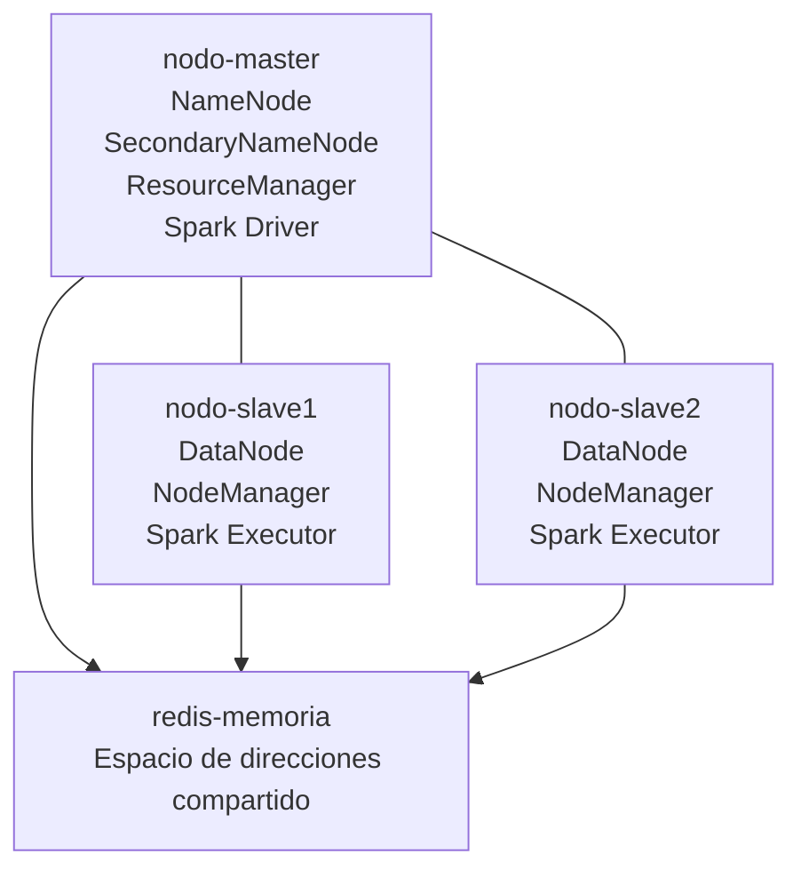

**# Clúster distribuido Hadoop con Docker**

Proyecto académico que implementa un clúster distribuido utilizando Docker Compose, Apache Hadoop, Spark y Redis.

El entorno está compuesto por tres nodos Hadoop y un servicio Redis. Permite realizar pruebas de HDFS, YARN, MapReduce, replicación, tolerancia a fallos, balanceo de almacenamiento, memoria compartida distribuida, comunicación segura mediante TLS/mTLS y exclusión mutua distribuida con Ricart-Agrawala.

**## Tecnologías**

\- Docker y Docker Compose
\- Ubuntu 22.04
\- Apache Hadoop 3.4.3
\- Apache Spark 3.5.7
\- OpenJDK 11
\- Python 3
\- Redis 7.4.10
\- redis-py 5.2.1
\- HDFS
\- YARN
\- MapReduce
\- OpenSSL 3
\- tcpdump
\- TLS/mTLS
\- Sockets TCP
\- Relojes lógicos de Lamport
\- Algoritmo de Ricart-Agrawala

**## Arquitectura**



\| Contenedor | Servicios |
\|---|---|
\| \`nodo-master\` | NameNode, SecondaryNameNode, ResourceManager y Spark Driver |
\| \`nodo-slave1\` | DataNode, NodeManager, Spark Executor y escritor concurrente |
\| \`nodo-slave2\` | DataNode, NodeManager, Spark Executor y escritor concurrente |
\| \`redis-memoria\` | Espacio central de direcciones compartidas |

Los contenedores se comunican mediante la red interna \`hadoop-network\`. No utilizan direcciones IP fijas: Docker resuelve cada nodo por su hostname.

Redis no forma parte de Hadoop. Es un servicio adicional utilizado en el Laboratorio 2 para administrar un espacio lógico de direcciones mutable y accesible desde los dos nodos esclavos.

**## Estructura**

\`\`\`text
hadoop-docker/
├── config/
│   ├── core-site.xml
│   ├── hdfs-site.xml
│   ├── mapred-site.xml
│   ├── workers
│   └── yarn-site.xml
├── laboratorio1/
│   ├── archivos-prueba/
│   └── evidencias/
├── laboratorio2/
│   ├── caso-a-broadcast/
│   │   └── caso\_a\_broadcast.py
│   ├── caso-b-redis/
│   │   ├── inicializar\_redis.py
│   │   ├── escritor\_slave1.py
│   │   ├── escritor\_slave2.py
│   │   └── comprobar\_resultado.py
│   ├── evidencias/
│   └── requirements.txt
├── laboratorio3/
│   ├── modulo-a-tls/
│   │   ├── archivos-prueba/
│   │   ├── archivos-recibidos/
│   │   ├── certificados/
│   │   │   ├── ca/
│   │   │   ├── nodo-master/
│   │   │   ├── nodo-slave1/
│   │   │   └── nodo-slave2/
│   │   ├── evidencias/
│   │   └── scripts/
│   └── modulo-b-ricart-agrawala/
│       ├── config/
│       ├── evidencias/
│       ├── logs/
│       ├── recurso/
│       └── nodo_ricart_agrawala.py
├── scripts/
│   ├── start-master.sh
│   ├── start-worker.sh
│   └── test-cluster.sh
├── spark-config/
│   ├── spark-defaults.conf
│   └── spark-env.sh
├── .gitignore
├── Dockerfile
├── docker-compose.yml
└── README.md
\`\`\`

**## Configuración principal**

\| Parámetro | Valor |
\|---|---|
\| NameNode | \`hdfs\://nodo-master:9000\` |
\| Replicación HDFS | \`2\` |
\| ResourceManager | \`nodo-master\` |
\| Memoria por NodeManager | \`1536 MB\` |
\| Ejecutores Spark | \`2\` |
\| Redis | \`redis-memoria:6379\` |
\| Direcciones compartidas | 256 |
\| Persistencia | Volúmenes Docker |
| Servidor mTLS | `nodo-master:8443` |
| Servidor TCP sin cifrado | `nodo-master:8080` |
| Ricart-Agrawala | `nodo-master:5000`, `nodo-slave1:5001`, `nodo-slave2:5002` |

**## Requisitos**

\- Docker Desktop con WSL 2 o Docker Engine para Linux.
\- Docker Compose.
\- Al menos 6 GB de memoria disponible; 8 GB recomendados.
\- Espacio suficiente para las imágenes de Hadoop y Spark.
\- Puertos del proyecto disponibles.

**## Construcción e inicio**

Construir e iniciar todos los servicios:

\`\`\`bash
docker compose up -d --build
\`\`\`

Comprobar el estado:

\`\`\`bash
docker compose ps
\`\`\`

Servicios esperados:

\`\`\`text
nodo-master
nodo-slave1
nodo-slave2
redis-memoria
\`\`\`

El maestro y Redis deben aparecer como \`healthy\`.

**## Interfaces web**

\| Servicio | Dirección |
\|---|---|
\| NameNode | http\://localhost:9870 |
\| ResourceManager | http\://localhost:8088 |
\| DataNode 1 | http\://localhost:9864 |
\| DataNode 2 | http\://localhost:9865 |
\| NodeManager 1 | http\://localhost:8042 |
\| NodeManager 2 | http\://localhost:8043 |
\| Spark | http\://localhost:4040 |

La interfaz de Spark en el puerto \`4040\` solamente está disponible mientras una aplicación Spark está ejecutándose.

**## Verificación de procesos**

Procesos del maestro:

\`\`\`bash
docker exec nodo-master jps
\`\`\`

Resultado esperado:

\`\`\`text
NameNode
SecondaryNameNode
ResourceManager
Jps
\`\`\`

Procesos de los trabajadores:

\`\`\`bash
docker exec nodo-slave1 jps
docker exec nodo-slave2 jps
\`\`\`

Resultado esperado:

\`\`\`text
DataNode
NodeManager
Jps
\`\`\`

**## Verificación automática del clúster Hadoop**

\`\`\`bash
docker exec nodo-master /scripts/test-cluster.sh
\`\`\`

Resultado esperado:

\`\`\`text
RESULTADO: CLÚSTER COMPLETAMENTE OPERATIVO
\`\`\`

Esta prueba comprueba HDFS, YARN, los dos trabajadores y los resultados del Laboratorio 1.

**# Laboratorio 1: HDFS, replicación y balanceo**

**## Estado de HDFS**

\`\`\`bash
docker exec nodo-master hdfs dfsadmin -report
\`\`\`

Debe mostrar:

\`\`\`text
Live datanodes (2)
\`\`\`

**## Crear un directorio**

\`\`\`bash
docker exec nodo-master hdfs dfs -mkdir -p /user/hadoop/laboratorio1
\`\`\`

**## Cargar un archivo**

\`\`\`bash
docker cp \\
  laboratorio1/archivos-prueba/datos-prueba.txt \\
  nodo-master:/tmp/datos-prueba.txt
\`\`\`

\`\`\`bash
docker exec nodo-master hdfs dfs -put -f \\
  /tmp/datos-prueba.txt \\
  /user/hadoop/laboratorio1/
\`\`\`

**## Listar los archivos**

\`\`\`bash
docker exec nodo-master hdfs dfs -ls -h \\
  /user/hadoop/laboratorio1
\`\`\`

**## Comprobar bloques y réplicas**

\`\`\`bash
docker exec nodo-master hdfs fsck \\
  /user/hadoop/laboratorio1/datos-prueba.txt \\
  -files -blocks -locations
\`\`\`

Cada bloque debe mostrar:

\`\`\`text
Live\_repl=2
\`\`\`

**## Verificar YARN**

\`\`\`bash
docker exec nodo-master yarn node -list
\`\`\`

Resultado esperado:

\`\`\`text
Total Nodes:2
\`\`\`

**## Ejecutar MapReduce WordCount**

El directorio de salida no debe existir antes de ejecutar el trabajo.

\`\`\`bash
docker exec nodo-master hadoop jar \\
  /opt/hadoop/share/hadoop/mapreduce/hadoop-mapreduce-examples-3.4.3.jar \\
  wordcount \\
  /user/hadoop/laboratorio1/datos-prueba.txt \\
  /user/hadoop/laboratorio1/salida-wordcount
\`\`\`

Consultar el resultado:

\`\`\`bash
docker exec nodo-master hdfs dfs -cat \\
  /user/hadoop/laboratorio1/salida-wordcount/part-r-00000
\`\`\`

**## Tolerancia a fallos**

Detener el segundo trabajador:

\`\`\`bash
docker compose stop nodo-slave2
\`\`\`

Comprobar que el archivo continúa disponible:

\`\`\`bash
docker exec nodo-master hdfs dfs -cat \\
  /user/hadoop/laboratorio1/datos-prueba.txt
\`\`\`

Recuperar el nodo:

\`\`\`bash
docker compose start nodo-slave2
\`\`\`

**## HDFS Balancer**

\`\`\`bash
docker exec nodo-master hdfs balancer -threshold 5
\`\`\`

El umbral representa el porcentaje de diferencia de utilización permitido entre los DataNodes.

Con replicación \`2\` y exactamente dos DataNodes, cada bloque termina almacenado en ambos nodos. Por ello, la utilidad observable del Balancer es limitada en esta topología. Su funcionamiento se aprecia mejor con replicación temporal \`1\` o con tres o más DataNodes.

**## Resultados del Laboratorio 1**

\- Registro de dos DataNodes en HDFS.
\- Registro de dos NodeManagers en YARN.
\- Replicación de bloques con factor 2.
\- Lectura de archivos durante la caída de un DataNode.
\- Recuperación del nodo detenido.
\- Redistribución de bloques mediante HDFS Balancer.
\- Procesamiento distribuido mediante MapReduce WordCount.
\- Persistencia de información mediante volúmenes Docker.

**# Laboratorio 2: Memoria Compartida Distribuida**

El Laboratorio 2 implementa dos modelos de memoria distribuida:

1\. Memoria distribuida de solo lectura mediante Spark Broadcast.
2\. Espacio lógico de direcciones mutable mediante Redis.

**## Caso A: Spark Broadcast**

El Caso A utiliza \`sc.broadcast()\` para distribuir un diccionario global desde el Spark Driver hacia los ejecutores administrados por YARN.

\`\`\`text
Spark Driver
  │
  ├── copia Broadcast → nodo-slave1
  └── copia Broadcast → nodo-slave2
\`\`\`

La estructura original contiene:

\`\`\`python
{
    "umbral\_alerta": 80,
    "factor\_penalizacion": 1.25,
    "modo": "laboratorio",
    "version": 1
}
\`\`\`

Después de crear el Broadcast, el Driver modifica el umbral a \`999\`. Los ejecutores continúan leyendo el valor original \`80\`, demostrando que las copias distribuidas no se actualizan automáticamente.

Ejecutar el caso:

\`\`\`bash
docker exec nodo-master spark-submit \\
  /laboratorio2/caso-a-broadcast/caso\_a\_broadcast.py
\`\`\`

Resultados esperados:

\`\`\`text
Nodos ejecutores observados: ['nodo-slave1', 'nodo-slave2']
Valor actual en el Driver: 999
Valor conservado en Broadcast: 80
DISTRIBUCIÓN CONFIRMADA
INMUTABILIDAD CONFIRMADA
\`\`\`

**### Interpretación del Caso A**

Spark Broadcast no crea una única dirección física compartida. El Driver serializa la estructura y distribuye una copia de solo lectura hacia cada proceso ejecutor.

Las lecturas posteriores se realizan localmente, reduciendo la transferencia repetitiva de datos por la red.

**## Caso B: espacio de direcciones con Redis**

Redis administra un espacio compartido compuesto por 256 direcciones lógicas:

\`\`\`text
memoria:0x0000
memoria:0x0001
memoria:0x0002
...
memoria:0x00FF
\`\`\`

El prefijo \`memoria:\` identifica el espacio compartido. El componente hexadecimal identifica una posición lógica diferente.

Estas claves no representan direcciones físicas de RAM. Son direcciones lógicas administradas dentro del espacio de claves de Redis.

\| Propiedad | Valor |
\|---|---|
\| Dirección inicial | \`memoria:0x0000\` |
\| Dirección final | \`memoria:0x00FF\` |
\| Total de direcciones | 256 |
\| Escritores concurrentes | 2 |
\| Escrituras por nodo | 100.000 |
\| Escrituras totales | 200.000 |

**### Inicializar el espacio**

\`\`\`bash
docker exec nodo-master python3 \\
  /laboratorio2/caso-b-redis/inicializar\_redis.py
\`\`\`

**### Verificar las direcciones**

\`\`\`bash
docker exec redis-memoria sh -c \\
  'redis-cli --scan --pattern "memoria:0x\*" | wc -l'
\`\`\`

Resultado esperado:

\`\`\`text
256
\`\`\`

Consultar varias posiciones:

\`\`\`bash
docker exec redis-memoria redis-cli MGET \\
  memoria:0x0000 \\
  memoria:0x001A \\
  memoria:0x0080 \\
  memoria:0x00FF
\`\`\`

**### Ejecutar los escritores concurrentemente**

Desde PowerShell:

\`\`\`powershell
$writer1 = Start-Job -Name "writer-slave1" -ScriptBlock {
    docker exec nodo-slave1 python3 /laboratorio2/caso-b-redis/escritor\_slave1.py
}

$writer2 = Start-Job -Name "writer-slave2" -ScriptBlock {
    docker exec nodo-slave2 python3 /laboratorio2/caso-b-redis/escritor\_slave2.py
}
\`\`\`

Esperar su finalización:

\`\`\`powershell
Wait-Job -Job $writer1, $writer2
\`\`\`

Mostrar los resultados:

\`\`\`powershell
Receive-Job -Job $writer1
Receive-Job -Job $writer2
\`\`\`

Eliminar los trabajos finalizados de PowerShell:

\`\`\`powershell
Remove-Job -Job $writer1, $writer2
\`\`\`

**### Generar el reporte**

\`\`\`bash
docker exec nodo-master python3 \\
  /laboratorio2/caso-b-redis/comprobar\_resultado.py
\`\`\`

Resultados esperados:

\`\`\`text
Direcciones encontradas: 256
ESPACIO CONFIRMADO: existen las 256 posiciones.
Escrituras totales: 200000
CONCURRENCIA CONFIRMADA: participaron los dos nodos.
\`\`\`

**### Interpretación del Caso B**

Cada operación \`SET\` es ejecutada de manera atómica por Redis: el valor se escribe completamente o no se escribe.

Sin embargo, ambos esclavos modifican las mismas posiciones. El último escritor de cada dirección depende del orden real de ejecución, por lo que el contenido final es consistente a nivel de operación, pero no determinista respecto al escritor ganador.

Las 200.000 escrituras no crean 200.000 direcciones. Sobrescriben repetidamente las 256 posiciones existentes, de forma comparable a múltiples escrituras sobre un espacio limitado de memoria.

**## Comparación de los casos**

\| Característica | Spark Broadcast | Redis |
\|---|---|---|
\| Tipo de acceso | Solo lectura | Lectura y escritura |
\| Modelo | Copias locales por ejecutor | Estado central compartido |
\| Actualización | No automática | Visible después de cada operación |
\| Escritura concurrente | No aplica | Sí |
\| Consistencia | Copia inmutable | Última escritura prevalece |
\| Direcciones | Copias en procesos separados | 256 posiciones lógicas |
\| Uso principal | Parámetros globales | Estado mutable compartido |

**## Resultados del Laboratorio 2**

\- Spark distribuyó el diccionario hacia los ejecutores administrados por YARN.
\- Las copias Broadcast conservaron el valor original.
\- La modificación en el Driver no alteró las copias existentes.
\- Redis creó un espacio compartido de 256 direcciones lógicas.
\- Los dos esclavos realizaron 100.000 escrituras cada uno.
\- Se procesaron 200.000 escrituras concurrentes.
\- No se generaron valores parcialmente escritos.
\- El último escritor de cada dirección fue no determinista.


**# Laboratorio 3: Seguridad e Integridad de Cómputo Distribuido**

El Laboratorio 3 amplía el clúster con dos componentes:

1. Seguridad de las comunicaciones inter-nodo mediante TLS y autenticación mutua mTLS.
2. Exclusión mutua distribuida mediante Ricart-Agrawala y relojes lógicos de Lamport.

**## Módulo A: TLS y autenticación mutua**

El nodo `nodo-master` actúa como servidor seguro en el puerto `8443`. Los nodos `nodo-slave1` y `nodo-slave2` se conectan como clientes y deben presentar certificados firmados por la Autoridad Certificadora interna del laboratorio.

La infraestructura de certificados contiene:

```text
Hadoop-Lab3-CA
├── nodo-master.crt
├── nodo-slave1.crt
└── nodo-slave2.crt
```

Las claves privadas `*.key` no se almacenan en Git. El archivo `.gitignore` también excluye capturas `*.pcap` y `*.pcapng`.

**### Iniciar el servidor mTLS**

```bash
docker exec --user root -it nodo-master \
  python3 /laboratorio3/modulo-a-tls/scripts/servidor_tls.py
```

El servidor:

- presenta el certificado de `nodo-master`;
- confía únicamente en certificados firmados por `Hadoop-Lab3-CA`;
- exige certificado de cliente mediante `ssl.CERT_REQUIRED`;
- permite TLS 1.2 o superior;
- recibe archivos únicamente después de completar el handshake.

**### Enviar un archivo desde nodo-slave1**

```bash
docker exec --user root nodo-slave1 \
  python3 /laboratorio3/modulo-a-tls/scripts/cliente_tls.py \
  --node nodo-slave1 \
  --file /laboratorio3/modulo-a-tls/archivos-prueba/mensaje.txt
```

**### Enviar un archivo desde nodo-slave2**

```bash
docker exec --user root nodo-slave2 \
  python3 /laboratorio3/modulo-a-tls/scripts/cliente_tls.py \
  --node nodo-slave2 \
  --file /laboratorio3/modulo-a-tls/archivos-prueba/mensaje.txt
```

Una conexión autorizada debe mostrar:

```text
Handshake TLS completado
Verification: OK
Archivo recibido correctamente
```

**### Cliente sin certificado**

```bash
docker exec nodo-slave1 \
  python3 /laboratorio3/modulo-a-tls/scripts/cliente_no_autorizado.py
```

El resultado esperado es:

```text
Conexión rechazada correctamente
tlsv13 alert certificate required
```

El servidor rechaza la conexión porque el cliente no entrega un certificado durante el handshake.

**### Certificado firmado por una CA falsa**

El laboratorio también incluye una CA no confiable y un certificado para `nodo-intruso`. Aunque el certificado esté correctamente firmado por esa CA, `nodo-master` lo rechaza porque su emisor no pertenece a la cadena de confianza configurada.

Resultado esperado:

```text
unknown ca
```

o:

```text
unable to get local issuer certificate
```

**### Comparar tráfico sin TLS y con mTLS**

Servidor sin TLS:

```bash
docker exec -it nodo-master \
  python3 /laboratorio3/modulo-a-tls/scripts/servidor_sin_tls.py
```

Captura del tráfico sin cifrado:

```bash
docker exec --user root nodo-master \
  tcpdump -i eth0 -A -nn port 8080
```

Cliente sin TLS:

```bash
docker exec nodo-slave1 \
  python3 /laboratorio3/modulo-a-tls/scripts/cliente_sin_tls.py
```

En esta captura, el contenido de `mensaje.txt` puede observarse en texto plano.

Captura del tráfico mTLS:

```bash
docker exec --user root nodo-master \
  tcpdump -i eth0 -A -nn port 8443
```

Durante una transferencia mTLS se observan paquetes en la red, pero el contenido del archivo no aparece de forma legible.

Guardar una captura:

```bash
docker exec --user root nodo-master \
  timeout 15 tcpdump \
  -i eth0 -nn -s 0 \
  -w /laboratorio3/modulo-a-tls/evidencias/trafico-mtls.pcap \
  port 8443
```

**### Resultados del Módulo A**

- Se creó una Autoridad Certificadora interna.
- Se emitieron certificados individuales para los tres nodos.
- Los dos esclavos completaron transferencias autenticadas mediante mTLS.
- Los clientes sin certificado fueron rechazados.
- Los certificados firmados por una CA desconocida fueron rechazados.
- `tcpdump` permitió comprobar la diferencia entre tráfico legible y tráfico cifrado.
- El contenido del archivo no fue visible durante la transferencia mTLS.

**## Módulo B: Ricart-Agrawala y relojes de Lamport**

El módulo implementa exclusión mutua distribuida entre los tres nodos mediante mensajes JSON enviados sobre sockets TCP.

| Nodo | Puerto |
|---|---:|
| `nodo-master` | `5000` |
| `nodo-slave1` | `5001` |
| `nodo-slave2` | `5002` |

Los mensajes principales son:

```text
REQUEST
REPLY
RELEASE
```

Cada nodo mantiene un reloj lógico de Lamport. Las solicitudes concurrentes se ordenan mediante la tupla:

```text
(timestamp lógico, nombre del nodo)
```

Si dos solicitudes tienen el mismo timestamp, el nombre del nodo funciona como criterio determinista de desempate.

**### Iniciar los tres nodos**

Terminal 1:

```bash
docker exec -it nodo-master python3 \
  /laboratorio3/modulo-b-ricart-agrawala/nodo_ricart_agrawala.py \
  --node nodo-master
```

Terminal 2:

```bash
docker exec -it nodo-slave1 python3 \
  /laboratorio3/modulo-b-ricart-agrawala/nodo_ricart_agrawala.py \
  --node nodo-slave1
```

Terminal 3:

```bash
docker exec -it nodo-slave2 python3 \
  /laboratorio3/modulo-b-ricart-agrawala/nodo_ricart_agrawala.py \
  --node nodo-slave2
```

Comandos interactivos disponibles:

```text
request <segundos>
status
exit
```

**### Prueba individual**

Desde `nodo-slave1`:

```text
request 5
```

El nodo envía `REQUEST`, espera los `REPLY`, entra en la sección crítica, actualiza `estado_global.txt` y posteriormente envía `RELEASE`.

**### Condición de carrera**

Desde los dos esclavos, ejecutar casi al mismo tiempo:

```text
request 10
```

El nodo con mayor prioridad entra primero. El otro conserva el estado `requesting`, espera el `REPLY` diferido y entra solamente después de que el primer nodo abandona la sección crítica.

La secuencia correcta en el recurso compartido es:

```text
nodo-slave1 | ENTRADA
nodo-slave1 | SALIDA
nodo-slave2 | ENTRADA
nodo-slave2 | SALIDA
```

No deben existir dos entradas consecutivas sin una salida intermedia.

Consultar el resultado:

```bash
cat laboratorio3/modulo-b-ricart-agrawala/recurso/estado_global.txt
```

Consultar los eventos relevantes:

```bash
grep -R "diferido\|ENTRANDO\|SALIENDO" \
  laboratorio3/modulo-b-ricart-agrawala/logs
```

**### Simulación de falla**

1. Solicitar la sección crítica desde `nodo-slave1`:

```text
request 30
```

2. Solicitar acceso desde `nodo-slave2`:

```text
request 10
```

3. Mientras `nodo-slave1` permanece dentro de la sección crítica, detenerlo:

```bash
docker compose stop nodo-slave1
```

Después del tiempo de espera configurado, `nodo-slave2` debe mostrar:

```text
TIMEOUT esperando REPLY de: ['nodo-slave1']
Solicitud cancelada por timeout.
```

El timeout evita una espera infinita, pero no autoriza automáticamente la entrada del segundo nodo. Sin mecanismos adicionales, no puede saberse con certeza si el nodo ausente murió, quedó aislado o continúa ejecutando la operación crítica.

Una implementación de producción requeriría mecanismos complementarios como heartbeats, membresía dinámica, consenso, leases y fencing tokens.

**### Resultados del Módulo B**

- Los tres nodos intercambiaron mensajes `REQUEST`, `REPLY` y `RELEASE`.
- Los relojes de Lamport establecieron un orden causal independiente del reloj físico.
- Las solicitudes simultáneas se resolvieron mediante prioridad lógica.
- Solo un nodo ingresó a la sección crítica a la vez.
- Las respuestas diferidas permitieron que el segundo nodo ingresara después.
- La caída de un participante fue detectada mediante timeout.
- La prueba evidenció las limitaciones de Ricart-Agrawala ante fallas de nodos.

**## Resultados del Laboratorio 3**

- Comunicación inter-nodo protegida mediante TLS/mTLS.
- Autenticación criptográfica de clientes y servidor.
- Rechazo de nodos sin identidad válida.
- Evidencia de tráfico cifrado mediante `tcpdump`.
- Exclusión mutua distribuida sin coordinador central.
- Orden causal mediante relojes lógicos de Lamport.
- Resolución determinista de solicitudes concurrentes.
- Análisis de tolerancia a fallas y bloqueo por ausencia de respuestas.

**# Administración del entorno**

**## Detener el clúster**

\`\`\`bash
docker compose down
\`\`\`

Este comando elimina los contenedores y la red, pero conserva los volúmenes de HDFS y Redis.

Para iniciarlo nuevamente:

\`\`\`bash
docker compose up -d
\`\`\`

**## Eliminar completamente los datos**

\> **\*\*Advertencia:\*\*** este comando elimina permanentemente la metadata del NameNode, los bloques de HDFS y la información persistida en Redis.

\`\`\`bash
docker compose down -v
\`\`\`

**## Autor**

**\*\*Rafael Bermeo Macías\*\***  
Ingeniería en Ciencias de la Computación  
Sistemas Distribuidos
