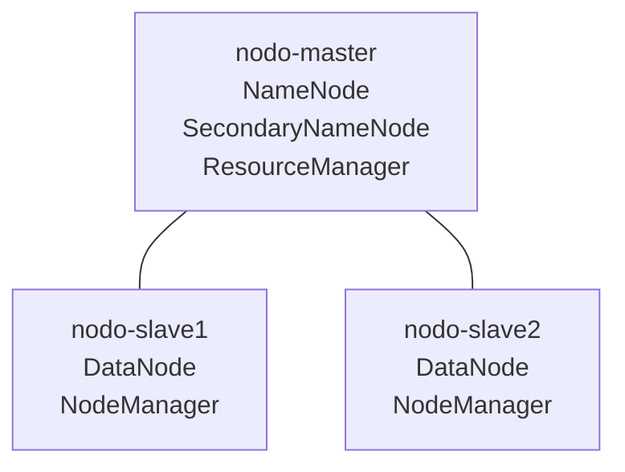

# Clúster Hadoop distribuido con Docker

Proyecto académico que implementa un clúster distribuido de Apache Hadoop utilizando Docker Compose.

El entorno reproduce una arquitectura de tres nodos con HDFS, YARN y MapReduce, permitiendo realizar pruebas de replicación, tolerancia a fallos y balanceo de almacenamiento.

## Tecnologías

- Docker y Docker Compose
- Ubuntu 22.04
- Apache Hadoop 3.4.3
- OpenJDK 11
- HDFS
- YARN
- MapReduce

## Arquitectura



| Contenedor | Servicios |
|---|---|
| `nodo-master` | NameNode, SecondaryNameNode y ResourceManager |
| `nodo-slave1` | DataNode y NodeManager |
| `nodo-slave2` | DataNode y NodeManager |

Los contenedores se comunican mediante la red Docker `hadoop-network`. No se utilizan direcciones IP fijas; Docker resuelve los nodos por hostname.

## Estructura

```text
hadoop-docker/
├── config/
│   ├── core-site.xml
│   ├── hdfs-site.xml
│   ├── mapred-site.xml
│   ├── workers
│   └── yarn-site.xml
├── laboratorio1/
│   ├── archivos-prueba/
│   └── evidencias/
├── scripts/
│   ├── start-master.sh
│   ├── start-worker.sh
│   └── test-cluster.sh
├── .gitignore
├── Dockerfile
├── docker-compose.yml
└── README.md
```

## Configuración principal

- NameNode: `hdfs://nodo-master:9000`
- Replicación HDFS: `2`
- ResourceManager: `nodo-master`
- Memoria disponible por NodeManager: `1536 MB`
- Volúmenes persistentes para NameNode y DataNodes

## Requisitos

- Docker Desktop con WSL 2 o Docker Engine para Linux
- Docker Compose
- Aproximadamente 6 GB de memoria disponible
- Espacio suficiente para construir la imagen de Hadoop

## Construcción

```bash
docker compose build
```

## Iniciar el clúster

```bash
docker compose up -d
```

Comprobar los contenedores:

```bash
docker compose ps
```

## Verificar procesos

Maestro:

```bash
docker exec nodo-master jps
```

Resultado esperado:

```text
NameNode
SecondaryNameNode
ResourceManager
```

Trabajadores:

```bash
docker exec nodo-slave1 jps
docker exec nodo-slave2 jps
```

Resultado esperado:

```text
DataNode
NodeManager
```

## Verificación automática

```bash
docker exec nodo-master /scripts/test-cluster.sh
```

Resultado esperado:

```text
RESULTADO: CLÚSTER COMPLETAMENTE OPERATIVO
```

## Interfaces web

| Servicio | Dirección |
|---|---|
| NameNode | http://localhost:9870 |
| ResourceManager | http://localhost:8088 |
| DataNode 1 | http://localhost:9864 |
| DataNode 2 | http://localhost:9865 |
| NodeManager 1 | http://localhost:8042 |
| NodeManager 2 | http://localhost:8043 |

## Comandos HDFS

Estado de los DataNodes:

```bash
docker exec nodo-master hdfs dfsadmin -report
```

Crear un directorio:

```bash
docker exec nodo-master hdfs dfs -mkdir -p /user/hadoop/laboratorio1
```

Listar archivos:

```bash
docker exec nodo-master hdfs dfs -ls -h /user/hadoop/laboratorio1
```

Comprobar bloques y réplicas:

```bash
docker exec nodo-master hdfs fsck /user/hadoop/laboratorio1/datos-prueba.txt -files -blocks -locations
```

## Verificar YARN

```bash
docker exec nodo-master yarn node -list
```

Deben aparecer dos NodeManagers activos:

```text
Total Nodes:2
```

## Prueba MapReduce

```bash
docker exec nodo-master hadoop jar \
  /opt/hadoop/share/hadoop/mapreduce/hadoop-mapreduce-examples-3.4.3.jar \
  wordcount \
  /user/hadoop/laboratorio1/datos-prueba.txt \
  /user/hadoop/laboratorio1/salida-wordcount
```

Consultar el resultado:

```bash
docker exec nodo-master hdfs dfs -cat \
  /user/hadoop/laboratorio1/salida-wordcount/part-r-00000
```

## Tolerancia a fallos

Detener el segundo trabajador:

```bash
docker compose stop nodo-slave2
```

Comprobar que el archivo continúa disponible:

```bash
docker exec nodo-master hdfs dfs -cat \
  /user/hadoop/laboratorio1/datos-prueba.txt
```

Recuperar el nodo:

```bash
docker compose start nodo-slave2
```

## HDFS Balancer

```bash
docker exec nodo-master hdfs balancer -threshold 5
```

El umbral representa el porcentaje de diferencia de utilización permitido entre DataNodes.

## Detener el clúster

```bash
docker compose down
```

Este comando elimina los contenedores y la red, pero conserva los volúmenes.

Para iniciar nuevamente:

```bash
docker compose up -d
```

## Eliminar completamente los datos

> Advertencia: este comando elimina permanentemente la metadata del NameNode y los bloques almacenados.

```bash
docker compose down -v
```

## Pruebas realizadas

- Registro de dos DataNodes en HDFS.
- Registro de dos NodeManagers en YARN.
- Replicación de bloques con factor 2.
- Lectura de archivos durante la caída de un DataNode.
- Recuperación de un nodo detenido.
- Redistribución de bloques mediante HDFS Balancer.
- Procesamiento distribuido con MapReduce WordCount.
- Persistencia mediante volúmenes Docker.

## Autor

Rafael Bermeo Macías  
Ingeniería en Ciencias de la Computación  
Sistemas Distribuidos