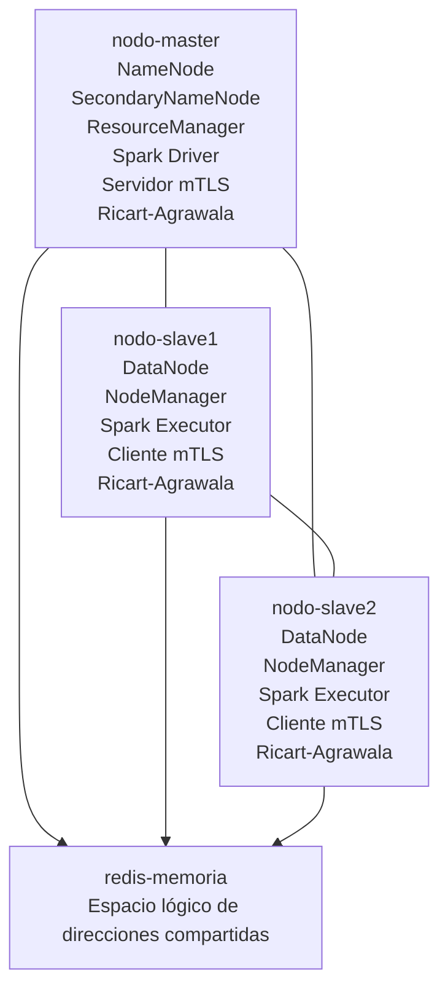
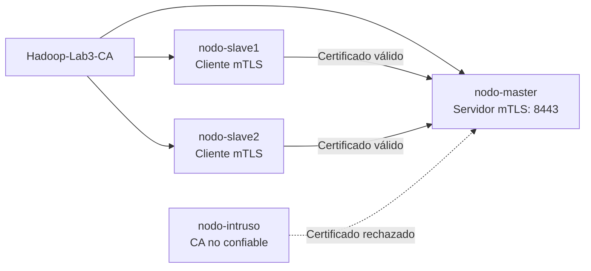
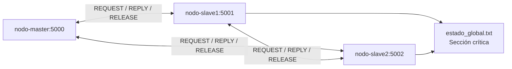

# Clúster distribuido Hadoop con Docker

Proyecto académico de **Sistemas Distribuidos** que implementa un clúster de tres nodos utilizando Docker Compose, Apache Hadoop, Apache Spark y Redis.

El entorno permite ejecutar prácticas de:

- HDFS, YARN y MapReduce.
- Replicación y tolerancia a fallos.
- Balanceo de almacenamiento.
- Memoria distribuida de solo lectura con Spark Broadcast.
- Memoria compartida mutable mediante Redis.
- Comunicación segura con TLS y autenticación mutua mTLS.
- Exclusión mutua distribuida mediante Ricart-Agrawala.
- Ordenamiento causal con relojes lógicos de Lamport.

---

## Tabla de contenidos

- [Tecnologías](#tecnologías)
- [Arquitectura](#arquitectura)
- [Contenedores y servicios](#contenedores-y-servicios)
- [Estructura del proyecto](#estructura-del-proyecto)
- [Configuración principal](#configuración-principal)
- [Requisitos](#requisitos)
- [Construcción e inicio](#construcción-e-inicio)
- [Interfaces web](#interfaces-web)
- [Verificación del clúster](#verificación-del-clúster)
- [Laboratorio 1: HDFS, replicación y balanceo](#laboratorio-1-hdfs-replicación-y-balanceo)
- [Laboratorio 2: Memoria compartida distribuida](#laboratorio-2-memoria-compartida-distribuida)
- [Laboratorio 3: Seguridad e integridad de cómputo distribuido](#laboratorio-3-seguridad-e-integridad-de-cómputo-distribuido)
- [Administración del entorno](#administración-del-entorno)
- [Seguridad del repositorio](#seguridad-del-repositorio)
- [Autor](#autor)

---

## Tecnologías

- Docker y Docker Compose
- Ubuntu 22.04
- Apache Hadoop 3.4.3
- Apache Spark 3.5.7
- OpenJDK 11
- Python 3
- Redis 7.4.10
- redis-py 5.2.1
- HDFS
- YARN
- MapReduce
- OpenSSL 3
- tcpdump
- TLS/mTLS
- Sockets TCP
- Relojes lógicos de Lamport
- Algoritmo de Ricart-Agrawala

---

## Arquitectura



Los contenedores se comunican mediante la red interna `hadoop-network`. No se utilizan direcciones IP fijas: Docker resuelve cada nodo por su `hostname`.

Redis no forma parte de Hadoop. Se incorpora como servicio adicional para el Laboratorio 2, donde representa un espacio lógico de direcciones mutable y accesible desde los nodos esclavos.

---

## Contenedores y servicios

| Contenedor | Servicios |
|---|---|
| `nodo-master` | NameNode, SecondaryNameNode, ResourceManager, Spark Driver, servidor mTLS y participante Ricart-Agrawala |
| `nodo-slave1` | DataNode, NodeManager, Spark Executor, cliente mTLS, escritor concurrente y participante Ricart-Agrawala |
| `nodo-slave2` | DataNode, NodeManager, Spark Executor, cliente mTLS, escritor concurrente y participante Ricart-Agrawala |
| `redis-memoria` | Espacio lógico centralizado de direcciones compartidas |

---

## Estructura del proyecto

```text
hadoop-docker/
├── config/
│   ├── core-site.xml
│   ├── hdfs-site.xml
│   ├── mapred-site.xml
│   ├── workers
│   └── yarn-site.xml
├── laboratorio1/
│   ├── archivos-prueba/
│   └── evidencias/
├── laboratorio2/
│   ├── caso-a-broadcast/
│   │   └── caso_a_broadcast.py
│   ├── caso-b-redis/
│   │   ├── inicializar_redis.py
│   │   ├── escritor_slave1.py
│   │   ├── escritor_slave2.py
│   │   └── comprobar_resultado.py
│   ├── evidencias/
│   └── requirements.txt
├── laboratorio3/
│   ├── modulo-a-tls/
│   │   ├── archivos-prueba/
│   │   ├── archivos-recibidos/
│   │   ├── archivos-recibidos-sin-tls/
│   │   ├── certificados/
│   │   │   ├── ca/
│   │   │   ├── ca-falsa/
│   │   │   ├── nodo-intruso/
│   │   │   ├── nodo-master/
│   │   │   ├── nodo-slave1/
│   │   │   └── nodo-slave2/
│   │   ├── evidencias/
│   │   └── scripts/
│   │       ├── cliente_no_autorizado.py
│   │       ├── cliente_sin_tls.py
│   │       ├── cliente_tls.py
│   │       ├── generar-certificado-nodo.sh
│   │       ├── servidor_sin_tls.py
│   │       └── servidor_tls.py
│   └── modulo-b-ricart-agrawala/
│       ├── config/
│       │   └── nodos.json
│       ├── evidencias/
│       ├── logs/
│       ├── recurso/
│       │   └── estado_global.txt
│       └── nodo_ricart_agrawala.py
├── scripts/
│   ├── start-master.sh
│   ├── start-worker.sh
│   └── test-cluster.sh
├── spark-config/
│   ├── spark-defaults.conf
│   └── spark-env.sh
├── .gitattributes
├── .gitignore
├── Dockerfile
├── docker-compose.yml
└── README.md
```

---

## Configuración principal

| Parámetro | Valor |
|---|---|
| NameNode | `hdfs://nodo-master:9000` |
| Replicación HDFS | `2` |
| ResourceManager | `nodo-master` |
| Memoria por NodeManager | `1536 MB` |
| Ejecutores Spark | `2` |
| Redis | `redis-memoria:6379` |
| Direcciones compartidas | `256` |
| Persistencia | Volúmenes Docker |
| Servidor TCP sin TLS | `nodo-master:8080` |
| Servidor mTLS | `nodo-master:8443` |
| Ricart-Agrawala master | `nodo-master:5000` |
| Ricart-Agrawala slave1 | `nodo-slave1:5001` |
| Ricart-Agrawala slave2 | `nodo-slave2:5002` |

---

## Requisitos

- Docker Desktop con WSL 2 o Docker Engine para Linux.
- Docker Compose.
- Al menos 6 GB de memoria disponible; 8 GB recomendados.
- Espacio suficiente para las imágenes de Hadoop y Spark.
- Puertos del proyecto disponibles.

---

## Construcción e inicio

Construir e iniciar todos los servicios:

```bash
docker compose up -d --build
```

Comprobar el estado:

```bash
docker compose ps
```

Servicios esperados:

```text
nodo-master
nodo-slave1
nodo-slave2
redis-memoria
```

El maestro y Redis deben aparecer como `healthy`.

---

## Interfaces web

| Servicio | Dirección |
|---|---|
| NameNode | http://localhost:9870 |
| ResourceManager | http://localhost:8088 |
| DataNode 1 | http://localhost:9864 |
| DataNode 2 | http://localhost:9865 |
| NodeManager 1 | http://localhost:8042 |
| NodeManager 2 | http://localhost:8043 |
| Spark | http://localhost:4040 |

La interfaz de Spark en el puerto `4040` solamente está disponible mientras una aplicación Spark está ejecutándose.

---

## Verificación del clúster

### Procesos del maestro

```bash
docker exec nodo-master jps
```

Resultado esperado:

```text
NameNode
SecondaryNameNode
ResourceManager
Jps
```

### Procesos de los trabajadores

```bash
docker exec nodo-slave1 jps
docker exec nodo-slave2 jps
```

Resultado esperado:

```text
DataNode
NodeManager
Jps
```

### Verificación automática

```bash
docker exec nodo-master /scripts/test-cluster.sh
```

Resultado esperado:

```text
RESULTADO: CLÚSTER COMPLETAMENTE OPERATIVO
```

La prueba verifica HDFS, YARN, los dos trabajadores y las operaciones básicas del clúster.

---

# Laboratorio 1: HDFS, replicación y balanceo

## Estado de HDFS

```bash
docker exec nodo-master hdfs dfsadmin -report
```

Debe mostrar:

```text
Live datanodes (2)
```

## Crear el directorio de trabajo

```bash
docker exec nodo-master hdfs dfs -mkdir -p /user/hadoop/laboratorio1
```

## Cargar un archivo

```bash
docker cp \
  laboratorio1/archivos-prueba/datos-prueba.txt \
  nodo-master:/tmp/datos-prueba.txt
```

```bash
docker exec nodo-master hdfs dfs -put -f \
  /tmp/datos-prueba.txt \
  /user/hadoop/laboratorio1/
```

## Listar archivos

```bash
docker exec nodo-master hdfs dfs -ls -h \
  /user/hadoop/laboratorio1
```

## Comprobar bloques y réplicas

```bash
docker exec nodo-master hdfs fsck \
  /user/hadoop/laboratorio1/datos-prueba.txt \
  -files -blocks -locations
```

Cada bloque debe mostrar:

```text
Live_repl=2
```

## Verificar YARN

```bash
docker exec nodo-master yarn node -list
```

Resultado esperado:

```text
Total Nodes:2
```

## Ejecutar MapReduce WordCount

El directorio de salida no debe existir antes de ejecutar el trabajo.

```bash
docker exec nodo-master hadoop jar \
  /opt/hadoop/share/hadoop/mapreduce/hadoop-mapreduce-examples-3.4.3.jar \
  wordcount \
  /user/hadoop/laboratorio1/datos-prueba.txt \
  /user/hadoop/laboratorio1/salida-wordcount
```

Consultar el resultado:

```bash
docker exec nodo-master hdfs dfs -cat \
  /user/hadoop/laboratorio1/salida-wordcount/part-r-00000
```

## Tolerancia a fallos

Detener el segundo trabajador:

```bash
docker compose stop nodo-slave2
```

Comprobar que el archivo continúa disponible:

```bash
docker exec nodo-master hdfs dfs -cat \
  /user/hadoop/laboratorio1/datos-prueba.txt
```

Recuperar el nodo:

```bash
docker compose start nodo-slave2
```

## HDFS Balancer

```bash
docker exec nodo-master hdfs balancer -threshold 5
```

El umbral representa el porcentaje de diferencia de utilización permitido entre los DataNodes.

Con replicación `2` y exactamente dos DataNodes, cada bloque termina almacenado en ambos nodos. Por ello, la utilidad observable del Balancer es limitada en esta topología. Su comportamiento se aprecia mejor con replicación temporal `1` o con tres o más DataNodes.

## Resultados del Laboratorio 1

- Registro de dos DataNodes en HDFS.
- Registro de dos NodeManagers en YARN.
- Replicación de bloques con factor 2.
- Lectura de archivos durante la caída de un DataNode.
- Recuperación del nodo detenido.
- Redistribución de bloques mediante HDFS Balancer.
- Procesamiento distribuido mediante MapReduce WordCount.
- Persistencia de información mediante volúmenes Docker.

---

# Laboratorio 2: Memoria compartida distribuida

El Laboratorio 2 implementa dos modelos de memoria distribuida:

1. Memoria distribuida de solo lectura mediante Spark Broadcast.
2. Espacio lógico de direcciones mutable mediante Redis.

## Caso A: Spark Broadcast

El Caso A utiliza `sc.broadcast()` para distribuir un diccionario global desde el Spark Driver hacia los ejecutores administrados por YARN.

```text
Spark Driver
  │
  ├── copia Broadcast → nodo-slave1
  └── copia Broadcast → nodo-slave2
```

La estructura original contiene:

```python
{
    "umbral_alerta": 80,
    "factor_penalizacion": 1.25,
    "modo": "laboratorio",
    "version": 1
}
```

Después de crear el Broadcast, el Driver modifica el umbral a `999`. Los ejecutores continúan leyendo el valor original `80`, demostrando que las copias distribuidas no se actualizan automáticamente.

Ejecutar el caso:

```bash
docker exec nodo-master spark-submit \
  /laboratorio2/caso-a-broadcast/caso_a_broadcast.py
```

Resultado esperado:

```text
Nodos ejecutores observados: ['nodo-slave1', 'nodo-slave2']
Valor actual en el Driver: 999
Valor conservado en Broadcast: 80
DISTRIBUCIÓN CONFIRMADA
INMUTABILIDAD CONFIRMADA
```

### Interpretación

Spark Broadcast no crea una única dirección física compartida. El Driver serializa la estructura y distribuye una copia de solo lectura hacia cada proceso ejecutor.

Las lecturas posteriores se realizan localmente, reduciendo la transferencia repetitiva de datos por la red.

## Caso B: espacio de direcciones con Redis

Redis administra un espacio compartido compuesto por 256 direcciones lógicas:

```text
memoria:0x0000
memoria:0x0001
memoria:0x0002
...
memoria:0x00FF
```

El prefijo `memoria:` identifica el espacio compartido. El componente hexadecimal representa una posición lógica distinta.

Estas claves no representan direcciones físicas de RAM. Son direcciones lógicas administradas dentro del espacio de claves de Redis.

| Propiedad | Valor |
|---|---|
| Dirección inicial | `memoria:0x0000` |
| Dirección final | `memoria:0x00FF` |
| Total de direcciones | `256` |
| Escritores concurrentes | `2` |
| Escrituras por nodo | `100.000` |
| Escrituras totales | `200.000` |

### Inicializar el espacio

```bash
docker exec nodo-master python3 \
  /laboratorio2/caso-b-redis/inicializar_redis.py
```

### Verificar las direcciones

```bash
docker exec redis-memoria sh -c \
  'redis-cli --scan --pattern "memoria:0x*" | wc -l'
```

Resultado esperado:

```text
256
```

Consultar posiciones:

```bash
docker exec redis-memoria redis-cli MGET \
  memoria:0x0000 \
  memoria:0x001A \
  memoria:0x0080 \
  memoria:0x00FF
```

### Ejecutar escritores concurrentemente

Desde PowerShell:

```powershell
$writer1 = Start-Job -Name "writer-slave1" -ScriptBlock {
    docker exec nodo-slave1 python3 /laboratorio2/caso-b-redis/escritor_slave1.py
}

$writer2 = Start-Job -Name "writer-slave2" -ScriptBlock {
    docker exec nodo-slave2 python3 /laboratorio2/caso-b-redis/escritor_slave2.py
}
```

Esperar su finalización:

```powershell
Wait-Job -Job $writer1, $writer2
```

Mostrar resultados:

```powershell
Receive-Job -Job $writer1
Receive-Job -Job $writer2
```

Eliminar los trabajos finalizados:

```powershell
Remove-Job -Job $writer1, $writer2
```

### Generar el reporte

```bash
docker exec nodo-master python3 \
  /laboratorio2/caso-b-redis/comprobar_resultado.py
```

Resultado esperado:

```text
Direcciones encontradas: 256
ESPACIO CONFIRMADO: existen las 256 posiciones.
Escrituras totales: 200000
CONCURRENCIA CONFIRMADA: participaron los dos nodos.
```

### Interpretación

Cada operación `SET` es ejecutada de manera atómica por Redis: el valor se escribe completamente o no se escribe.

Sin embargo, ambos esclavos modifican las mismas posiciones. El último escritor de cada dirección depende del orden real de ejecución. El contenido final es consistente a nivel de operación, pero no determinista respecto al escritor ganador.

Las 200.000 escrituras no crean 200.000 direcciones. Sobrescriben repetidamente las 256 posiciones existentes.

## Comparación de los casos

| Característica | Spark Broadcast | Redis |
|---|---|---|
| Tipo de acceso | Solo lectura | Lectura y escritura |
| Modelo | Copias locales por ejecutor | Estado central compartido |
| Actualización | No automática | Visible después de cada operación |
| Escritura concurrente | No aplica | Sí |
| Consistencia | Copia inmutable | Última escritura prevalece |
| Direcciones | Copias en procesos separados | 256 posiciones lógicas |
| Uso principal | Parámetros globales | Estado mutable compartido |

## Resultados del Laboratorio 2

- Spark distribuyó el diccionario hacia los ejecutores administrados por YARN.
- Las copias Broadcast conservaron el valor original.
- La modificación en el Driver no alteró las copias existentes.
- Redis creó un espacio compartido de 256 direcciones lógicas.
- Los dos esclavos realizaron 100.000 escrituras cada uno.
- Se procesaron 200.000 escrituras concurrentes.
- No se generaron valores parcialmente escritos.
- El último escritor de cada dirección fue no determinista.

---

# Laboratorio 3: Seguridad e integridad de cómputo distribuido

El Laboratorio 3 amplía el clúster con dos componentes:

1. Seguridad de comunicaciones inter-nodo mediante TLS y autenticación mutua mTLS.
2. Exclusión mutua distribuida mediante Ricart-Agrawala y relojes lógicos de Lamport.

## Módulo A: TLS y autenticación mutua

El nodo `nodo-master` actúa como servidor seguro en el puerto `8443`. Los nodos `nodo-slave1` y `nodo-slave2` se conectan como clientes y deben presentar certificados firmados por la Autoridad Certificadora interna del laboratorio.



### Infraestructura de certificados

```text
Hadoop-Lab3-CA
├── nodo-master.crt
├── nodo-slave1.crt
└── nodo-slave2.crt
```

Cada nodo posee:

- clave privada;
- solicitud CSR;
- certificado firmado por la CA;
- nombre DNS en `Subject Alternative Name`;
- extensiones para autenticación de cliente o servidor.

Las claves privadas `*.key` no deben almacenarse en Git.

### Verificar certificados

```bash
docker exec nodo-master openssl verify \
  -CAfile /laboratorio3/modulo-a-tls/certificados/ca/ca.crt \
  /laboratorio3/modulo-a-tls/certificados/nodo-master/nodo-master.crt
```

```bash
docker exec nodo-slave1 openssl verify \
  -CAfile /laboratorio3/modulo-a-tls/certificados/ca/ca.crt \
  /laboratorio3/modulo-a-tls/certificados/nodo-slave1/nodo-slave1.crt
```

```bash
docker exec nodo-slave2 openssl verify \
  -CAfile /laboratorio3/modulo-a-tls/certificados/ca/ca.crt \
  /laboratorio3/modulo-a-tls/certificados/nodo-slave2/nodo-slave2.crt
```

Resultado esperado:

```text
nodo-master.crt: OK
nodo-slave1.crt: OK
nodo-slave2.crt: OK
```

### Iniciar el servidor mTLS

```bash
docker exec --user root -it nodo-master \
  python3 /laboratorio3/modulo-a-tls/scripts/servidor_tls.py
```

El servidor:

- presenta el certificado de `nodo-master`;
- confía únicamente en certificados firmados por `Hadoop-Lab3-CA`;
- exige certificado de cliente mediante `ssl.CERT_REQUIRED`;
- permite TLS 1.2 o superior;
- recibe archivos después de completar el handshake.

### Enviar un archivo desde nodo-slave1

```bash
docker exec --user root nodo-slave1 \
  python3 /laboratorio3/modulo-a-tls/scripts/cliente_tls.py \
  --node nodo-slave1 \
  --file /laboratorio3/modulo-a-tls/archivos-prueba/mensaje.txt
```

### Enviar un archivo desde nodo-slave2

```bash
docker exec --user root nodo-slave2 \
  python3 /laboratorio3/modulo-a-tls/scripts/cliente_tls.py \
  --node nodo-slave2 \
  --file /laboratorio3/modulo-a-tls/archivos-prueba/mensaje.txt
```

Resultado esperado:

```text
Handshake TLS completado
Versión TLS: TLSv1.3
Certificado del servidor verificado
Archivo enviado correctamente
Archivo recibido correctamente
```

### Verificar integridad del archivo

```bash
sha256sum \
  laboratorio3/modulo-a-tls/archivos-prueba/mensaje.txt
```

```bash
sha256sum \
  laboratorio3/modulo-a-tls/archivos-recibidos/*nodo-slave1*
```

Los hashes deben ser iguales.

### Cliente sin certificado

```bash
docker exec nodo-slave1 \
  python3 /laboratorio3/modulo-a-tls/scripts/cliente_no_autorizado.py
```

Resultado esperado:

```text
Conexión rechazada correctamente
tlsv13 alert certificate required
```

En el servidor:

```text
peer did not return a certificate
```

### Certificado firmado por una CA falsa

Verificar que el certificado del intruso es válido para la CA falsa:

```bash
docker exec nodo-master openssl verify \
  -CAfile /laboratorio3/modulo-a-tls/certificados/ca-falsa/ca-falsa.crt \
  /laboratorio3/modulo-a-tls/certificados/nodo-intruso/nodo-intruso.crt
```

Comprobar que la CA legítima no confía en él:

```bash
docker exec nodo-master openssl verify \
  -CAfile /laboratorio3/modulo-a-tls/certificados/ca/ca.crt \
  /laboratorio3/modulo-a-tls/certificados/nodo-intruso/nodo-intruso.crt
```

Resultado esperado:

```text
unable to get local issuer certificate
verification failed
```

Probar contra el servidor:

```bash
docker exec --user root nodo-slave1 openssl s_client \
  -connect nodo-master:8443 \
  -cert /laboratorio3/modulo-a-tls/certificados/nodo-intruso/nodo-intruso.crt \
  -key /laboratorio3/modulo-a-tls/certificados/nodo-intruso/nodo-intruso.key \
  -CAfile /laboratorio3/modulo-a-tls/certificados/ca/ca.crt \
  -verify_hostname nodo-master
```

Resultado esperado:

```text
unknown ca
```

### Comparar tráfico sin TLS y con mTLS

#### Tráfico sin TLS

Servidor:

```bash
docker exec -it nodo-master \
  python3 /laboratorio3/modulo-a-tls/scripts/servidor_sin_tls.py
```

Captura:

```bash
docker exec --user root nodo-master \
  tcpdump -i eth0 -A -nn port 8080
```

Cliente:

```bash
docker exec nodo-slave1 \
  python3 /laboratorio3/modulo-a-tls/scripts/cliente_sin_tls.py
```

El contenido de `mensaje.txt` puede observarse en texto plano.

#### Tráfico con mTLS

Servidor:

```bash
docker exec --user root -it nodo-master \
  python3 /laboratorio3/modulo-a-tls/scripts/servidor_tls.py
```

Captura:

```bash
docker exec --user root nodo-master \
  tcpdump -i eth0 -A -nn port 8443
```

Cliente:

```bash
docker exec --user root nodo-slave1 \
  python3 /laboratorio3/modulo-a-tls/scripts/cliente_tls.py \
  --node nodo-slave1 \
  --file /laboratorio3/modulo-a-tls/archivos-prueba/mensaje.txt
```

Se observan paquetes, pero el contenido del archivo no aparece de manera legible.

### Guardar capturas

Sin TLS:

```bash
docker exec --user root nodo-master \
  timeout 15 tcpdump \
  -i eth0 -nn -s 0 \
  -w /laboratorio3/modulo-a-tls/evidencias/trafico-sin-tls.pcap \
  port 8080
```

Con mTLS:

```bash
docker exec --user root nodo-master \
  timeout 15 tcpdump \
  -i eth0 -nn -s 0 \
  -w /laboratorio3/modulo-a-tls/evidencias/trafico-mtls.pcap \
  port 8443
```

Buscar texto en la captura sin TLS:

```bash
docker exec --user root nodo-master \
  tcpdump -A \
  -r /laboratorio3/modulo-a-tls/evidencias/trafico-sin-tls.pcap \
  | grep -i "Archivo de prueba"
```

Buscar texto en la captura mTLS:

```bash
docker exec --user root nodo-master \
  tcpdump -A \
  -r /laboratorio3/modulo-a-tls/evidencias/trafico-mtls.pcap \
  | grep -i "Archivo de prueba"
```

En la captura sin TLS la frase debe aparecer. En la captura mTLS no debe producirse ningún resultado.

### Resultados del Módulo A

- Creación de una Autoridad Certificadora interna.
- Emisión de certificados individuales para los tres nodos.
- Transferencias autenticadas mediante mTLS.
- Rechazo de clientes sin certificado.
- Rechazo de certificados firmados por una CA desconocida.
- Comparación entre tráfico legible y tráfico cifrado.
- Verificación de integridad mediante SHA-256.

## Módulo B: Ricart-Agrawala y relojes de Lamport

El módulo implementa exclusión mutua distribuida entre los tres nodos mediante mensajes JSON enviados sobre sockets TCP.



| Nodo | Puerto |
|---|---:|
| `nodo-master` | `5000` |
| `nodo-slave1` | `5001` |
| `nodo-slave2` | `5002` |

Mensajes utilizados:

```text
REQUEST
REPLY
RELEASE
```

Cada nodo mantiene un reloj lógico de Lamport.

Evento local:

```text
L = L + 1
```

Recepción de mensaje:

```text
Llocal = max(Llocal, Lremoto) + 1
```

Las solicitudes se ordenan mediante:

```text
(timestamp lógico, nombre del nodo)
```

Ejemplo de desempate:

```text
(1, nodo-slave1) < (1, nodo-slave2)
```

### Configuración de nodos

Archivo:

```text
laboratorio3/modulo-b-ricart-agrawala/config/nodos.json
```

```json
{
  "nodo-master": {
    "host": "nodo-master",
    "port": 5000
  },
  "nodo-slave1": {
    "host": "nodo-slave1",
    "port": 5001
  },
  "nodo-slave2": {
    "host": "nodo-slave2",
    "port": 5002
  }
}
```

### Iniciar los tres nodos

Terminal 1:

```bash
docker exec -it nodo-master python3 \
  /laboratorio3/modulo-b-ricart-agrawala/nodo_ricart_agrawala.py \
  --node nodo-master
```

Terminal 2:

```bash
docker exec -it nodo-slave1 python3 \
  /laboratorio3/modulo-b-ricart-agrawala/nodo_ricart_agrawala.py \
  --node nodo-slave1
```

Terminal 3:

```bash
docker exec -it nodo-slave2 python3 \
  /laboratorio3/modulo-b-ricart-agrawala/nodo_ricart_agrawala.py \
  --node nodo-slave2
```

Comandos disponibles:

```text
request <segundos>
status
exit
```

### Prueba individual

Desde `nodo-slave1`:

```text
request 5
```

Flujo esperado:

```text
Solicitando acceso a la sección crítica
ENVIADO REQUEST a nodo-master
ENVIADO REQUEST a nodo-slave2
REPLY recibido de nodo-master
REPLY recibido de nodo-slave2
Todos los REPLY fueron recibidos
>>> ENTRANDO A LA SECCIÓN CRÍTICA <<<
<<< SALIENDO DE LA SECCIÓN CRÍTICA >>>
ENVIADO RELEASE a nodo-master
ENVIADO RELEASE a nodo-slave2
```

### Recurso compartido

```text
laboratorio3/modulo-b-ricart-agrawala/recurso/estado_global.txt
```

Consultar:

```bash
cat laboratorio3/modulo-b-ricart-agrawala/recurso/estado_global.txt
```

### Condición de carrera

Ejecutar casi simultáneamente:

En `nodo-slave1`:

```text
request 10
```

En `nodo-slave2`:

```text
request 10
```

El nodo con mayor prioridad lógica entra primero. El segundo espera el `REPLY` diferido.

Secuencia correcta:

```text
nodo-slave1 | ENTRADA
nodo-slave1 | SALIDA
nodo-slave2 | ENTRADA
nodo-slave2 | SALIDA
```

No deben existir dos entradas consecutivas sin una salida intermedia.

Verificar:

```bash
grep -E "ENTRADA|SALIDA" \
  laboratorio3/modulo-b-ricart-agrawala/recurso/estado_global.txt
```

Consultar decisiones de prioridad:

```bash
grep -R "diferido\|ENTRANDO\|SALIENDO" \
  laboratorio3/modulo-b-ricart-agrawala/logs
```

### Estado interno

Durante una prueba:

```text
status
```

Ejemplo:

```json
{
  "node": "nodo-slave2",
  "clock": 5,
  "requesting": true,
  "in_critical_section": false,
  "request_timestamp": 1,
  "received_replies": [
    "nodo-master"
  ],
  "deferred_replies": []
}
```

### Simulación de falla

1. En `nodo-slave1`:

```text
request 30
```

2. En `nodo-slave2`:

```text
request 10
```

3. Mientras `nodo-slave1` permanece dentro de la sección crítica:

```bash
docker compose stop nodo-slave1
```

Después del timeout, `nodo-slave2` debe mostrar:

```text
TIMEOUT esperando REPLY de: ['nodo-slave1']
Solicitud cancelada por timeout.
```

El timeout evita una espera infinita, pero no autoriza automáticamente la entrada del segundo nodo. Sin mecanismos adicionales, no es posible determinar si el nodo ausente murió, quedó aislado o continúa ejecutando la operación crítica.

Recuperar el nodo:

```bash
docker compose start nodo-slave1
```

Volver a iniciar el proceso:

```bash
docker exec -it nodo-slave1 python3 \
  /laboratorio3/modulo-b-ricart-agrawala/nodo_ricart_agrawala.py \
  --node nodo-slave1
```

Una implementación de producción requeriría:

- heartbeats;
- detección de fallas;
- membresía dinámica;
- consenso;
- leases;
- persistencia de estado;
- fencing tokens.

### Resultados del Módulo B

- Intercambio de mensajes `REQUEST`, `REPLY` y `RELEASE`.
- Orden causal mediante relojes de Lamport.
- Desempate determinista por identificador de nodo.
- Acceso exclusivo a la sección crítica.
- Respuestas diferidas para solicitudes concurrentes.
- Detección de ausencia de respuestas mediante timeout.
- Análisis de las limitaciones del algoritmo ante fallas.

## Resultados del Laboratorio 3

- Comunicación inter-nodo protegida mediante TLS/mTLS.
- Autenticación criptográfica del servidor y los clientes.
- Rechazo de nodos sin identidad válida.
- Evidencia de tráfico cifrado mediante `tcpdump`.
- Exclusión mutua distribuida sin coordinador central.
- Orden causal mediante relojes lógicos de Lamport.
- Resolución determinista de solicitudes concurrentes.
- Análisis de tolerancia a fallas.

---

# Administración del entorno

## Detener el clúster

```bash
docker compose down
```

Este comando elimina los contenedores y la red, pero conserva los volúmenes de HDFS y Redis.

Iniciar nuevamente:

```bash
docker compose up -d
```

## Reconstruir después de modificar el Dockerfile

```bash
docker compose down
docker compose build --no-cache
docker compose up -d
```

## Eliminar completamente los datos

> **Advertencia:** este comando elimina permanentemente la metadata del NameNode, los bloques de HDFS y la información persistida en Redis.

```bash
docker compose down -v
```

## Consultar logs

```bash
docker compose logs -f
```

Servicio específico:

```bash
docker logs -f nodo-master
```

## Comprobar el estado completo

```bash
docker compose ps -a
```

---

# Seguridad del repositorio

No deben subirse:

- claves privadas `*.key`;
- almacenes `*.p12` o `*.jks`;
- números de serie generados `*.srl`;
- capturas de red `*.pcap` o `*.pcapng`;
- archivos temporales o credenciales.

Reglas recomendadas para `.gitignore`:

```gitignore
# Certificados y claves privadas
laboratorio3/modulo-a-tls/certificados/**/*.key
laboratorio3/modulo-a-tls/certificados/**/*.p12
laboratorio3/modulo-a-tls/certificados/**/*.jks
laboratorio3/modulo-a-tls/certificados/**/*.srl

# Capturas de red
laboratorio3/**/*.pcap
laboratorio3/**/*.pcapng

# Python
__pycache__/
*.pyc

# Logs
laboratorio3/modulo-b-ricart-agrawala/logs/*.log
```

Para evitar errores de formato `CRLF` en scripts Linux, se recomienda:

```gitattributes
*.sh text eol=lf
*.py text eol=lf
*.yml text eol=lf
*.yaml text eol=lf
```

---

# Autor

**Rafael Bermeo Macías**  
Ingeniería en Ciencias de la Computación  
Sistemas Distribuidos
